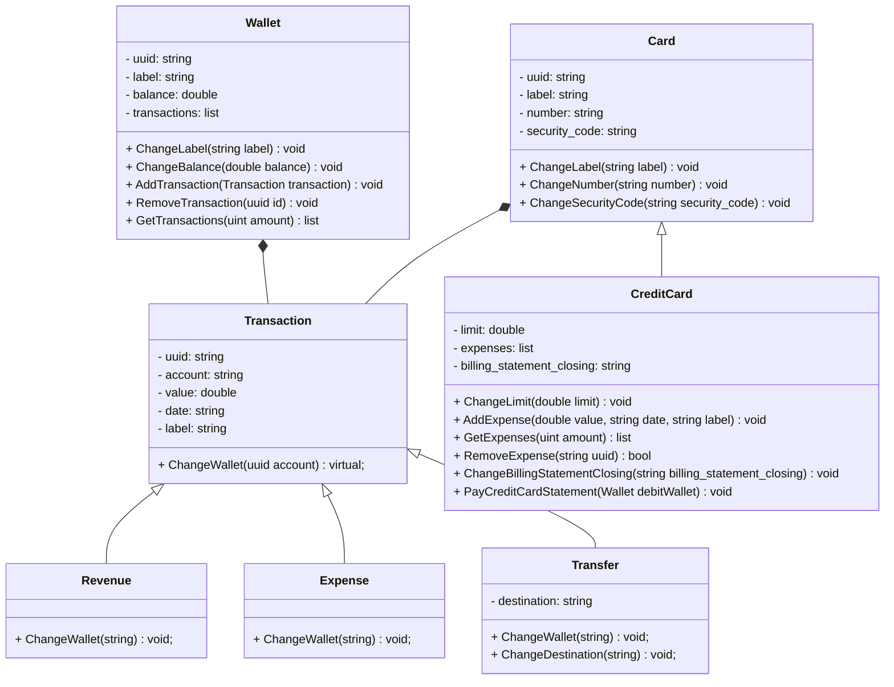

```mermaid
classDiagram

class Wallet {
    - uuid: string
    - label: string
    - balance: double
    - transactions: list<transcations>

    + ChangeLabel(string label) void
    + ChangeBalance(double balance) void
    + AddTransaction(Transaction transaction) void
    + RemoveTransaction(uuid id) void
    + GetTransactions(uint amount) list<Transaction>
}

Wallet *-- Transaction
   
class Card {
    - uuid: string
    - label: string
    - number: string
    - security_code: string

    + ChangeLabel(string label) void
    + ChangeNumber(string number) void
    + ChangeSecurityCode(string security_code) void
}

Card *-- Transaction
   
Card <|-- CreditCard
   
class CreditCard {
    - limit: double
    - expenses: list<Expenses>
    - billing_statement_closing: string

    + ChangeLimit(double limit) void
    + AddExpense(double value, string date, string label) void
    + GetExpenses(uint amount) list<Expenses>
    + RemoveExpense(string uuid) bool
    + ChangeBillingStatementClosing(string billing_statement_closing) void
    + PayCreditCardStatement(Wallet debitWallet) void
}

class Transaction {
    - uuid: string
    - account: string 
    - value: double
    - date: string
    - label: string

   + ChangeWallet(uuid account) virtual;
}

Transaction <|-- Revenue
Transaction <|-- Expense
Transaction <|-- Transfer

class Revenue {
    + ChangeWallet(string) void;
}

class Expense {
    + ChangeWallet(string) void;
}

class Transfer {
    - destination: string

    + ChangeWallet(string) void;
    + ChangeDestination(string) void;
}

```
