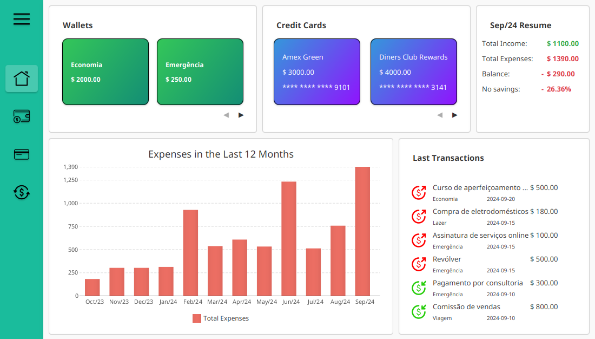

# MY_MONEY
MY_MONEY é uma aplicação de gerenciamento financeiro pessoal que permite aos usuários registrar, visualizar e acompanhar suas transações financeiras. A aplicação possibilita a categorização de receitas e despesas, cálculo de balanços mensais e exibição de gráficos para fácil entendimento da economia mensal.



## Compilação e Execução

### Compilação
```sh
mvn compile
```

### Execução do programa 
```sh
mvn javafx:run
# or
mvn spring-boot:run
```

### Execução dos testes
```sh
mvn test
```
