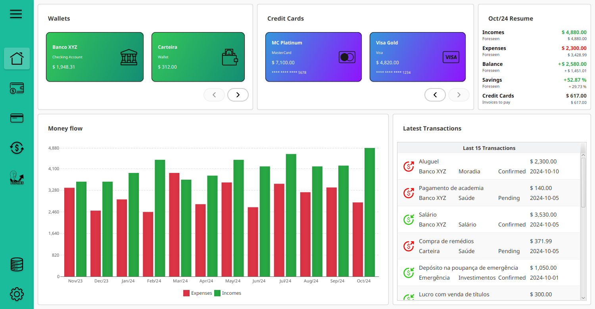

# MOINEX

**MOINEX** é uma aplicação de gerenciamento financeiro pessoal que permite aos usuários registrar, visualizar e acompanhar suas transações financeiras. A aplicação possibilita a categorização de receitas e despesas, cálculo de balanços mensais e exibição de gráficos, proporcionando uma visão clara da saúde financeira de forma intuitiva.



## Tecnologias Utilizadas

- **Spring Boot**: Para gerenciar a construção da aplicação Java
- **Spring Data JPA**: Facilita a interação com o banco de dados relacional, simplificando a persistência de dados.
- **JavaFX**: Utilizado para criar a interface gráfica do usuário (GUI)
- **SQLite**: Banco de dados leve, utilizado para armazenar as transações financeiras localmente.

## Dependências
Para compilar o programa é necessário ter o [Maven](https://maven.apache.org/) e o Java 21 instalados.

## Instalação
Após a instalação das dependências, execute o script de instalação com o comando:

```sh
sh scripts/install.sh
```

Após a execução, os diretórios necessários serão criados, e o banco de dados SQLite será armazenado em **`$HOME/.moinex/data/`**.

Os logs serão armazenados no diretório **`$HOME/.local/state/moinex`**. 
